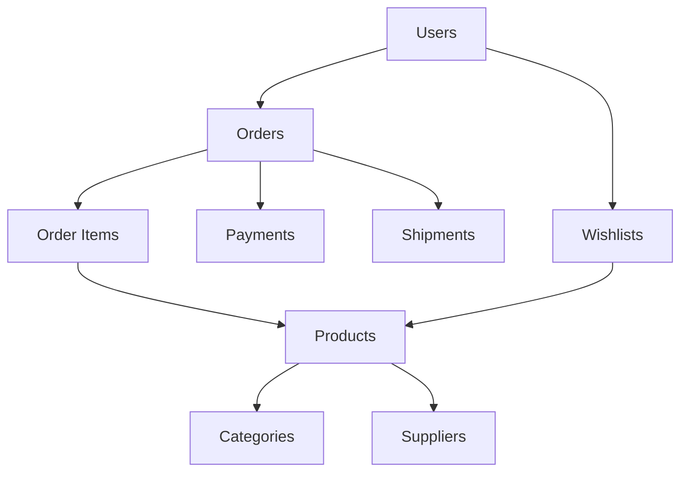
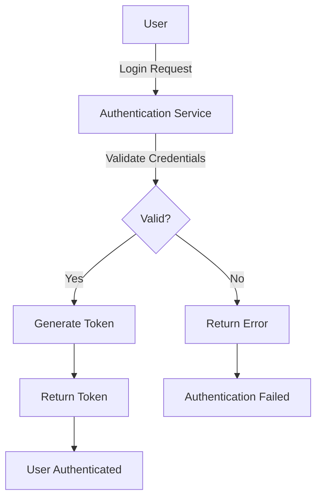
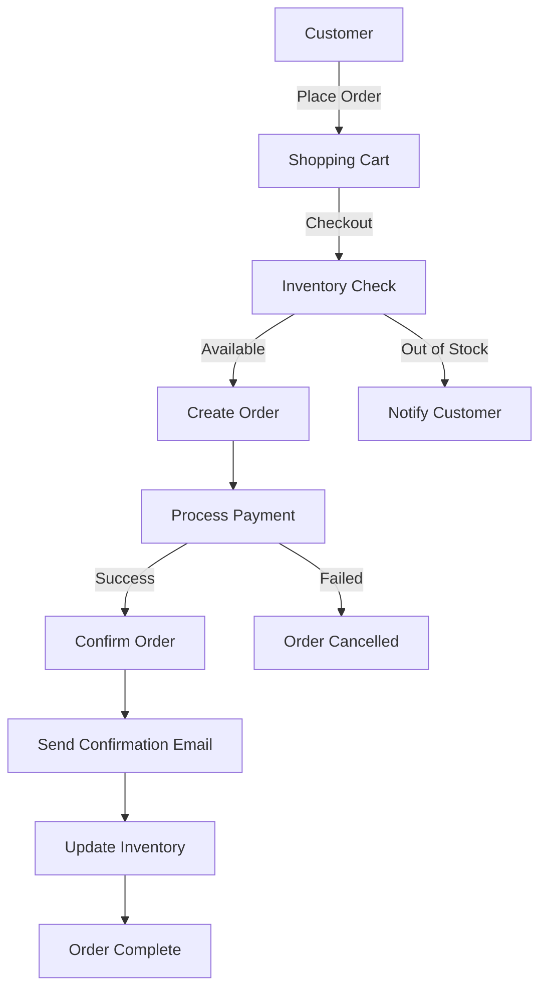
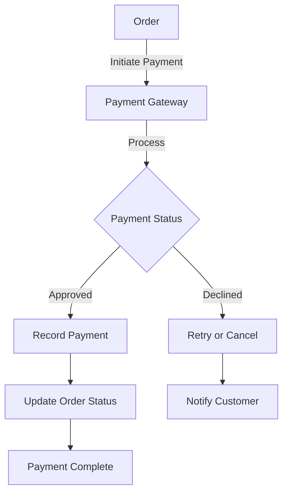
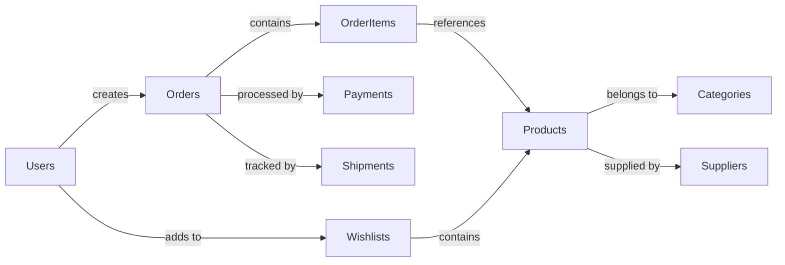
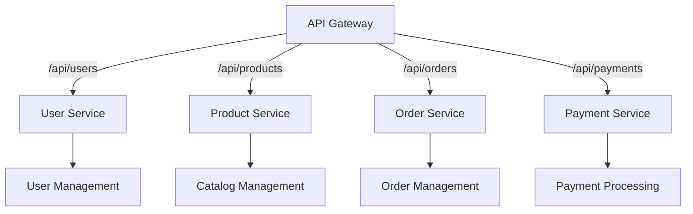
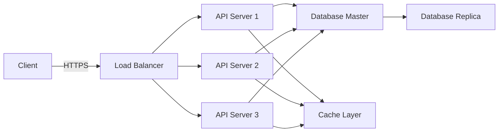

# SQL E-Commerce Case Study - Architecture

## System Overview

The SQL E-Commerce Case Study demonstrates a complete database design for an e-commerce platform. This architecture documentation outlines the system components, data flow, and relationships.

## Database Schema

## User Authentication Flow

## Order Processing Workflow

## Payment Processing Flow

## Data Relationships

## API Endpoints Structure

## Deployment Architecture

## Key Features

- **User Management**: Registration, authentication, and profile management
- **Product Catalog**: Browsing, searching, and filtering products by categories
- **Shopping Cart**: Add/remove items, view totals, and checkout
- **Order Management**: Create, track, and manage customer orders
- **Payment Processing**: Secure payment gateway integration
- **Inventory Management**: Track stock levels and availability
- **Wishlist**: Save favorite products for future purchase
- **Shipment Tracking**: Monitor order delivery status

## Database Tables

### Users
- user_id (PK)
- email (UNIQUE)
- password_hash
- first_name
- last_name
- created_at
- updated_at

### Products
- product_id (PK)
- name
- description
- price
- stock_quantity
- category_id (FK)
- supplier_id (FK)
- created_at
- updated_at

### Orders
- order_id (PK)
- user_id (FK)
- order_date
- total_amount
- status
- created_at
- updated_at

### Order Items
- order_item_id (PK)
- order_id (FK)
- product_id (FK)
- quantity
- unit_price
- created_at

### Payments
- payment_id (PK)
- order_id (FK)
- amount
- payment_method
- status
- transaction_id
- created_at

### Shipments
- shipment_id (PK)
- order_id (FK)
- carrier
- tracking_number
- status
- estimated_delivery
- created_at
- updated_at

### Categories
- category_id (PK)
- name
- description
- created_at

### Suppliers
- supplier_id (PK)
- name
- contact_email
- phone
- address
- created_at

### Wishlists
- wishlist_id (PK)
- user_id (FK)
- product_id (FK)
- created_at

## Security Considerations

- Password hashing using bcrypt or similar algorithms
- JWT tokens for API authentication
- HTTPS for all communications
- SQL injection prevention through parameterized queries
- Rate limiting on API endpoints
- Regular security audits and updates

## Performance Optimization

- Database indexing on frequently queried columns
- Caching layer for product catalogs and popular items
- Load balancing across multiple API servers
- Query optimization and stored procedures
- Database replication for read operations

## Conclusion

This architecture provides a scalable and secure foundation for an e-commerce platform with proper separation of concerns, robust data management, and comprehensive transaction handling.
