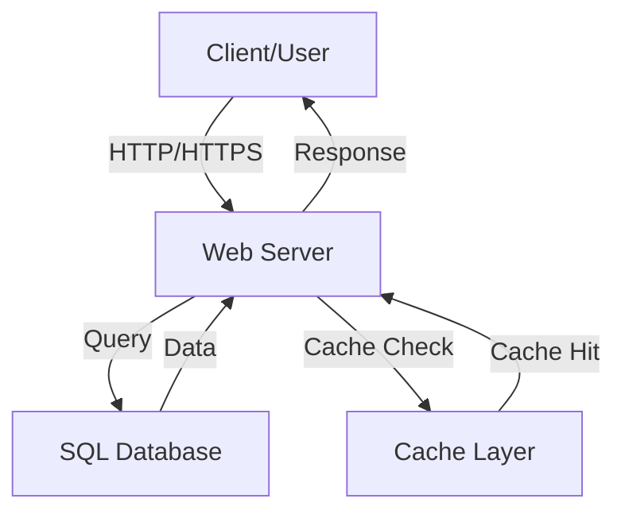
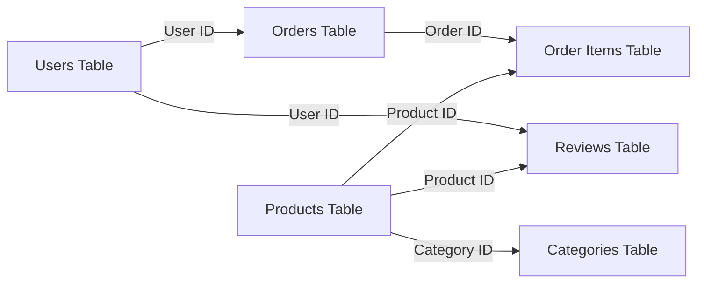
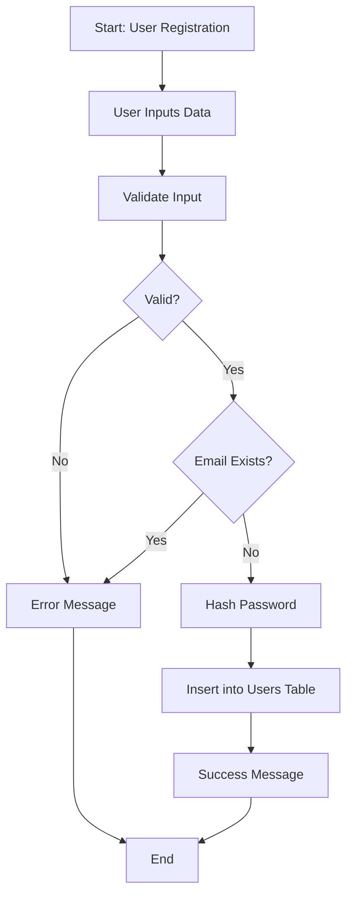
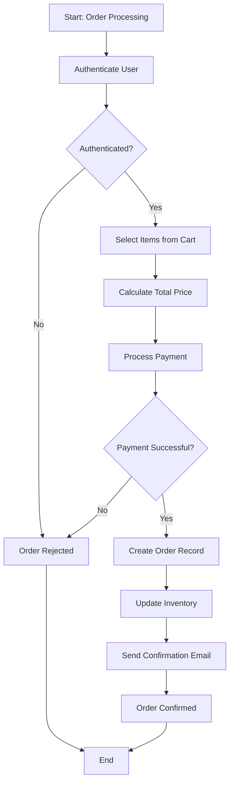
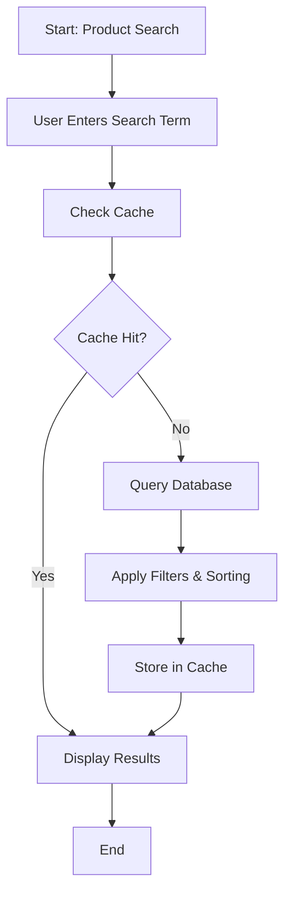
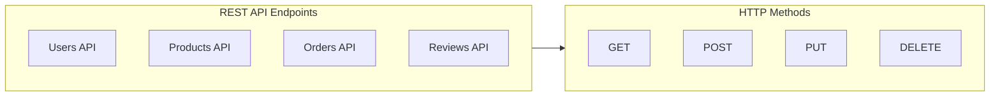
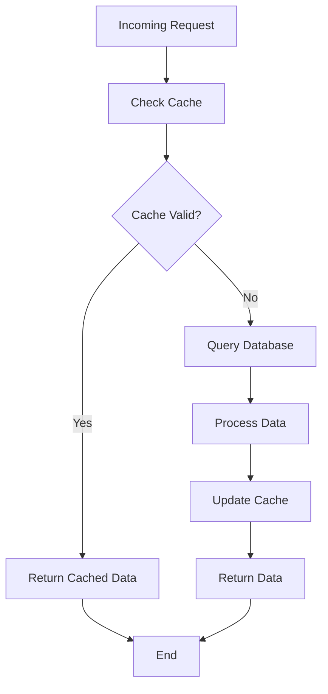
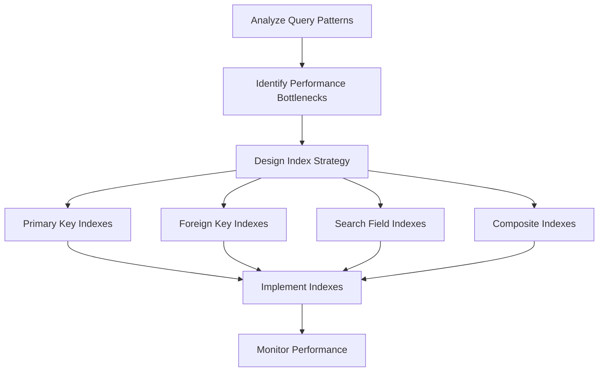
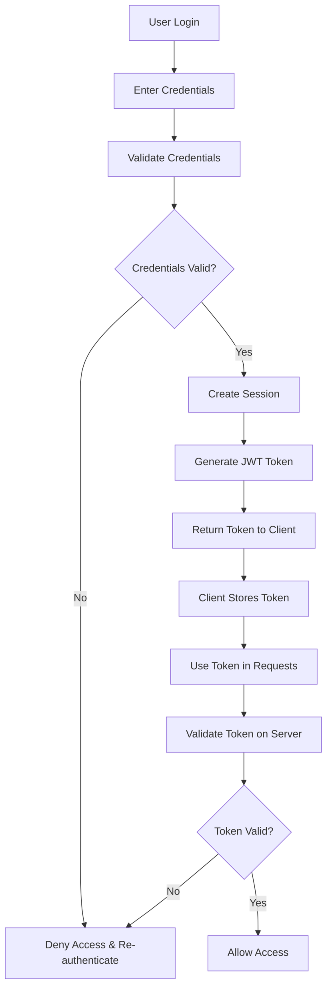
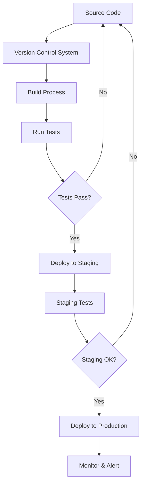

# SQL E-Commerce Case Study - Architecture Documentation

## Overview
This document describes the architecture and data flow of the SQL E-Commerce Case Study project.

## System Architecture

### High-Level Architecture Diagram

## Database Architecture

### Database Schema Diagram

## Data Flow Diagrams

### User Registration Flow

### Order Processing Flow

### Product Search Flow

## API Endpoints Architecture

### REST API Structure

## Performance Optimization

### Caching Strategy

### Database Indexing Strategy

## Security Architecture

### Authentication & Authorization Flow

## Deployment Architecture

### Application Deployment Flow

## Technology Stack

### Backend Stack
- **Language**: SQL/Database
- **Web Framework**: Node.js/Express or Python/Flask
- **Database**: MySQL/PostgreSQL
- **Cache**: Redis
- **Authentication**: JWT

### Frontend Stack
- **Framework**: React/Vue/Angular
- **Build Tool**: Webpack/Vite
- **Package Manager**: npm/yarn
- **Styling**: CSS/SCSS/Tailwind

### DevOps Stack
- **Version Control**: Git/GitHub
- **CI/CD**: GitHub Actions/Jenkins
- **Containerization**: Docker
- **Orchestration**: Kubernetes (optional)
- **Monitoring**: ELK Stack/Prometheus

## Conclusion

This architecture provides a scalable, secure, and performant foundation for the SQL E-Commerce Case Study project. All diagrams use proper Mermaid syntax for consistency and reliability.
